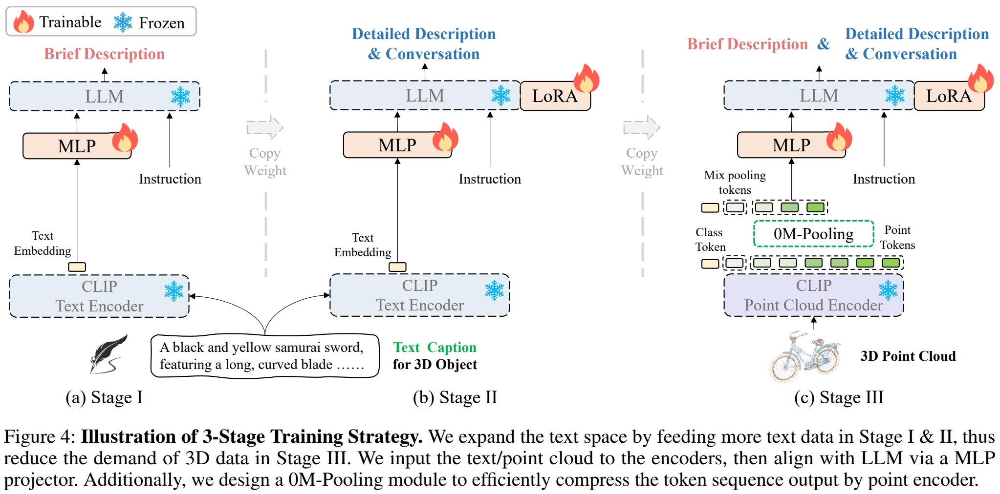
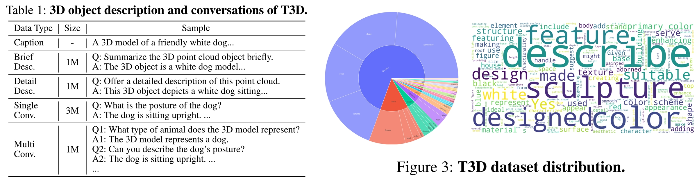

<h1 align="center"><strong>More Text, Less Point: Towards 3D Data-Efficient Point-Language Understanding</strong></h1>
  <p align="center">
    Yuan Tang*&emsp; Xu Han*&emsp; Xianzhi Li<sup>✝</sup>&emsp; Qiao Yu&emsp; Jinfeng Xu&emsp; Yixue Hao&emsp; Long Hu&emsp; Min Chen 
    <br>
    Huazhong University of Science and Technology&emsp;South China University of Technology
  </p>
</p>

<p align="center">
    <a><strong>AAAI 2025 </strong></a>
    <a href='https://arxiv.org/pdf/2408.15966'></a>
    <a href='https://huggingface.co/YuanTang96/GreenPLM'></a>
</p>


<!-- contents with emoji -->
## 📋 Contents  

- [🔍 Overview](#-overview)
- [📦 Training and Evaluation](#-Training-and-Evaluation)
- [🔗 Citation](#-citation)
- [📄 License](#-license)
- [📚 Related Work](#-related-work)
- [👏 Acknowledgements](#-acknowledgements)

## 🔍 Overview




- We introduce a new task of 3D data-efficient point-language understanding, aiming to enable LLMs to achieve robust 3D understanding with minimal 3D data.
- We propose GreenPLM to tackle this 3D data-limited task from a novel perspective, enhancing point-LLM alignment with more free-text data. 
- we introduce a 6M T3D dataset, design a 3-stage training strategy, and present a 0M-Pooling module for token pooling.
- We introduce the Accuracy-to-3D-Data Ratio (A3DR) to measure the efficiency of 3D data usage and establish an evaluation benchmark based on open-source LLMs. 
- GreenPLM outperforms previous models using only 12\% of 3D data and even surpasses GPT4Point (660K 3D data) using only text, demonstrating superior 3D data efficiency.


## 📦 Training-and-Evaluation

### Download project
The **code, weights, and dataset** of the project have already been uploaded to  [Hugging Face](https://huggingface.co/YuanTang96/GreenPLM). Simply download them once to get started with the project.

### Install Environment  
Enter the project directory and execute the following command:
```bash
conda create -n greenplm python=3.10 -y
conda activate greenplm
bash  envInstall.sh
 ```

### Project Directory Introduction
- `./greenplm/release` contains the paper's weights, training scripts, and testing scripts.
- `./pretrained_weight` stores the pre-trained weights required for the training and testing phases of the project.
- `./lava-vicuna_2024_4_Phi-3-mini-4k-instruct` is the weight directory for Phi-3.
- `./dataset/T3D` is the 6M T3D dataset proposed in this project.
- `./dataset/T3D/stage_1/brief_1M_caption.json` is the dataset from T3D for Stage I.
- `./dataset/T3D/stage_2/stage_2_data_210k.json` is the dataset from T3D for Stage II.

### Dataset Preparation

`./dataset/Objaverse/8192_npy.zip` contains the point cloud data from Objaverse that is required for this project. To unzip the dataset:

```bash
unzip ./dataset/Objaverse/8192_npy.zip -d ./dataset/Objaverse/
```

### Inference

#### Paper Weights
##### GreenPLM-0
The model trained only on text data, i.e., (Stage I & Stage II).

```bash
bash ./release/paper/scripts/test/release_stage_2.sh
```
The output JSON results are saved in `./release/paper/result_json/stage_2`.

##### GreenPLM
The model trained on a small amount of 3D data, i.e., (Stage I & Stage II & Stage III).

```bash
bash ./release/paper/scripts/test/release_stage_3.sh
```
The output JSON results are saved in `./release/paper/result_json/stage_3`.


#### Weights Using All T3D Dataset
<details>
  <summary>We also provide weights trained using the entire T3D dataset, meaning we use 5M data from T3D in Stage II, instead of just 210k as in our paper. (click to expand)</summary>

##### GreenPLM-0
The model trained only on text data, i.e., (Stage I & Stage II).

```bash
bash ./release/5M_data_seting/scripts/test/release_5M_stage_2.sh
```
The output JSON results are saved in `./release/5M_data_seting/result_json/stage_2`.

##### GreenPLM
The model trained on a small amount of 3D data, i.e., (Stage I & Stage II & Stage III).

```bash
bash ./release/5M_data_seting/scripts/test/release_5M_stage_3.sh
```
The output JSON results are saved in `./release/5M_data_seting/result_json/stage_3`.

</details>


### Evaluation
#### Using LLM
 
   - You can get the **DASHSCOPE_API_KEY**   from [aliyun](https://bailian.console.aliyun.com/?apiKey=1#/api-key). The evaluation may require 9 CNY (~ 1.3 USD).
   - If you have enough GPU resources, you can also build your own Qwen2-72B-Instruct service, following the [Qwen2](https://github.com/QwenLM/Qwen2?tab=readme-ov-file). Then evaluate the results for free!

   1. Evaluate the open vocabulary classification on objaverse
   ```bash
   export PYTHONPATH=$PWD
   export DASHSCOPE_API_KEY=sk-xxx
   python ./pointllm/eval/evaluator_opensource_llm_QwenAPI.py  \
           --results_path /path/to/evaluation/PointLLM_brief_description_val_200_GT_Objaverse_classification_prompt0.json  \
           --eval_type open-free-form-classification  \
           --model_type qwen2-72b-instruct \
           --parallel --num_workers 4
   ```

   ```bash
   export PYTHONPATH=$PWD
   export DASHSCOPE_API_KEY=sk-xxx
   python ./pointllm/eval/evaluator_opensource_llm_QwenAPI.py  \
           --results_path /path/to/evaluation/PointLLM_brief_description_val_200_GT_Objaverse_classification_prompt1.json  \
           --eval_type open-free-form-classification  \
           --model_type qwen2-72b-instruct \
           --parallel --num_workers 4
   ```

   2. Evaluate the close-set zero-shot classification on ModelNet40

   ```bash
   export PYTHONPATH=$PWD
   export DASHSCOPE_API_KEY=sk-xxx
   python ./pointllm/eval/evaluator_opensource_llm_QwenAPI.py  \
       --results_path /path/to/evaluation/ModelNet_classification_prompt0.json  \
       --eval_type modelnet-close-set-classification  \
       --model_type qwen2-72b-instruct \
       --parallel --num_workers 4
   ```
   
   ```bash
   export PYTHONPATH=$PWD
   export DASHSCOPE_API_KEY=sk-xxx
   python ./pointllm/eval/evaluator_opensource_llm_QwenAPI.py  \
       --results_path /path/to/evaluation/ModelNet_classification_prompt1.json  \
       --eval_type modelnet-close-set-classification  \
       --model_type qwen2-72b-instruct \
       --parallel --num_workers 4
   ```

   3. Evaluate the object captioning on objaverse

   ```bash
   export PYTHONPATH=$PWD
   export DASHSCOPE_API_KEY=sk-xxx
   python ./pointllm/eval/evaluator_opensource_llm_QwenAPI.py  \
           --results_path /path/to/evaluation/PointLLM_brief_description_val_200_GT_Objaverse_captioning_prompt2.json  \
           --eval_type object-captioning  \
           --model_type qwen2-72b-instruct \
           --parallel --num_workers 4
  ```

#### Traditional Metric Evaluation
For the object captioning task, run the following command to evaluate model outputs with traditional metrics  Sentence-BERT and SimCSE.

```bash
CUDA_VISIBLE_DEVICES=0 python pointllm/eval/traditional_evaluator.py --results_path /path/to/evaluation/PointLLM_brief_description_val_200_GT_Objaverse_captioning_prompt2.json
```


## Training

**Stage I**
```bash
bash ./release/paper/scripts/train/1.sh
```

**Stage II**: GreenPLM-0
```bash
bash ./release/paper/scripts/train/2.sh
```

**Stage III**: GreenPLM
```bash
bash ./release/paper/scripts/train/3.sh
```

<details>
  <summary>We also provide training scripts using the entire T3D dataset, meaning we use 5M data from T3D in Stage II, instead of just 210k as in our paper. (click to expand)</summary>

**Stage II**: GreenPLM-0
```bash
bash ./release/5M_data_seting/scripts/train/2.sh
```

**Stage III**: GreenPLM
```bash
bash ./release/5M_data_seting/scripts/train/3.sh
```

</details>

**Note**: You can modify the `--output_dir` argument in the scripts to set the output directory for the trained weights.


## 🔗 Citation
If you find our work helpful, please consider citing:
```bibtex
@inproceedings{tang2025more,
  title={More text, less point: Towards 3d data-efficient point-language understanding},
  author={Tang, Yuan and Han, Xu and Li, Xianzhi and Yu, Qiao and Xu, Jinfeng and Hao, Yixue and Hu, Long and Chen, Min},
  booktitle={Proceedings of the AAAI Conference on Artificial Intelligence},
  volume={39},
  number={7},
  pages={7284--7292},
  year={2025}
}
```

## 📄 License
<a rel="license" href="http://creativecommons.org/licenses/by-nc-sa/4.0/"></a>
<br />
This work is under the <a rel="license" href="http://creativecommons.org/licenses/by-nc-sa/4.0/">Creative Commons Attribution-NonCommercial-ShareAlike 4.0 International License</a>.

## 📚 Related Work
Together, Let's make LLM for 3D great!
- [Point-Bind & Point-LLM](https://arxiv.org/abs/2309.00615): aligns point clouds with Image-Bind to reason multi-modality input without 3D-instruction data training.
- [3D-LLM](https://arxiv.org/abs/2307.12981): employs 2D foundation models to encode multi-view images of 3D point clouds.
- [PointLLM](https://arxiv.org/abs/2308.16911): employs 3D point clouds with LLaVA.
- [ShapeLLM](http://arxiv.org/abs/2402.17766): combines a  powerful point cloud encoder with LLM for embodied scenes.
- [MiniGPT-3D](https://arxiv.org/pdf/2405.01413) : takes the first step toward efficient 3D-LLM, requiring only a single RTX 3090 GPU and one day of training time.

## 🌟 Star History

[](https://www.star-history.com/#TangYuan96/GreenPLM&type=date&legend=top-left)

## 👏 Acknowledgements
We would like to thank the authors of [PointLLM](https://github.com/OpenRobotLab/PointLLM), [Uni3D](https://github.com/baaivision/Uni3D), [Phi-3](https://huggingface.co/microsoft/Phi-3-mini-4k-instruct), and [LLaVA-pp](https://github.com/mbzuai-oryx/LLaVA-pp) for their great works and repos.
